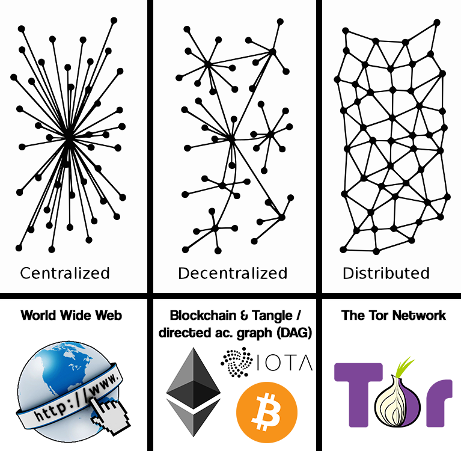

# 💎 Decentralized World Wide Web ERC-721 🌐
This is a decentralized **World Wide Web** implemented with an **ERC-721 Token** on the **Ethereum Blockchain**.</br>
I created this project to show, that there's another way to build the World Wide Web. </br>

## 🌐 The Purpose of a decentralized World Wide Web 🌐
- Nothing can be deleted, once it's published
- Uncensorable
- Decentralized



## ❓ How it works ❓
A Website is build by **ERC-721 Tokens**, each of these Token can carry up to **100 ASCII Chars (100 * 256)**.</br>
The **PageItem** is a **Char Array** with the **length of 100 items**, the Chars are saved as **ASCII (8-Bit)**.</br>
A **decentralized Website** will be build with these **PageItems**. 

For the Moment only the HTML is being saved in these **ERC-721 Tokens**.
JavaScript & CSS can be loaded from external sources.

### 📝 Pseudo Code (Simplified) 📝
```
contract PageItem is ERC721{
    
    // The PageItem is a char array with the length of 100 items, the Chars are saved as ASCII (8-Bit)

    struct PageItem{
    	uint256 char0;
    	uint256 char1;
    	uint256 char2;
    	uint256 char3;
    	uint256 char4;
    	uint256 char5;
    	uint256 char6;
    	uint256 char7;
    	uint256 char8;
    	uint256 char9;
    	uint256 char10;
    	uint256 char11;
    	uint256 char12;
    	...
    	uint256 char97;
    	uint256 char98;
    	uint256 char99;
    }

    function convertCharArrayToString(charArray[] chrar) public{ // chararray 100x256

    }

    function convertStringToCharArray(string str) public{

    }
    
}
```
